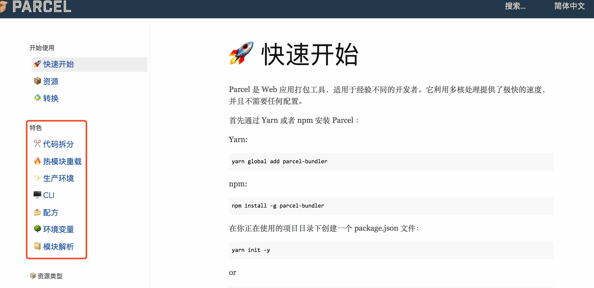

[toc]

[ts文档](https://www.tslang.cn/docs/home.html)
[技术胖的 TypeScript免费视频图文教程（2W字）](https://juejin.cn/post/6876240277208563720#heading-79)

# 1.ts中的访问类型

- public:公有修饰符，可以在类内或者类外使用public修饰的属性或者行为，默认修饰符。
- protected:受保护的修饰符，可以本类和子类中使用protected修饰的属性和行为。
- private : 私有修饰符，只可以在类内使用private修饰的属性和行为。

# 2.tsc,ts-node

```shell
tsc demo1.ts
// 输出文件
demo1.js

// 执行demo1.js
node demo1.js
```

```bash
tsc -w // 监视编译
```

命令行直接执行ts文件（ts-node比较慢）

```shell
npm install -g ts-node

// 执行
ts-node demo1.ts
```

# 3.类型注解、类型推断

- 如果 `TS` 能够自动分析变量类型， 我们就什么也不需要做了
- 如果 `TS` 无法分析变量类型的话， 我们就需要使用类型注解

```ts
// 类型注解
let count: number;
count = 123;

// 类型推断
let countInference = 123;
```

# 4.混合数组

```ts
const arr: (number | string)[] = [1, "string", 2]
```

# 5.类型别名

```ts
type Lady = { name: string, age: Number };

const xiaoJieJies: Lady[] = [
  { name: "Tom", age: 18 },
  { name: "Lily", age: 28 },
];

type Girl = string 
```

# 6.元组

```ts
const xiaojiejies: [string, string, number][] = [
  ["dajiao", "teacher", 28],
  ["liuying", "teacher", 18],
  ["cuihua", "teacher", 25],
];
```

# 7.类实现(implements)接口

```ts
interface Person{
    name:string
    age:number
    say():string
}
  
class Student implements Person {
    name="Tom"
    age = 28
    say(){
        return '2321'
    }
}
```

# 8.getter和setter

```ts
class Xiaojiejie {
  constructor(private _age:number){}
  get age(){
      return this._age-10
  }
  set age(age:number){
    this._age=age
  }
}

const dajiao = new Xiaojiejie(28)
dajiao.age=25
console.log(dajiao.age)
```

# 9.静态修饰符`static`

```ts
class Girl {
  static sayLove() {
    return "I Love you";
  }
}
// 可以不用实例化，直接引用
console.log(Girl.sayLove());
```

# 10.抽象类

```ts
abstract class Girl{
    abstract skill()  //因为没有具体的方法，所以我们这里不写括号
}

class Waiter extends Girl{
    skill() {
        console.log('111')
    }
}

class Students extends Girl{
    skill() {
        console.log('2222')
    }
}
```

# 11. tsconfig.json

执行

```bash
tsc -init
```

直接生成tsconfig.json文件；


在此目录上执行tsc，此时ts文件被编译成js，此时就根据tsconfig.json配置项来进行处理；


## 1). 文件筛选

```js
// "exclude": ["demo1.ts"],  /*排查demo1.ts*/
// "include": ["demo1.ts"],  /*只编译demo1.ts*/
// "files": ["demo1.ts"],  /*同include*/
  "compilerOptions": {}
```

和compilerOptions同级的可以增加这几个文件筛选的项，一般项目不加

## 2).compilerOptions中removeComments

`"removeComments": true, `编译时去掉注释

## 3).compilerOptions中严格模型系列

```js
/* Strict Type-Checking Options */
"strict": true,                           /* Enable all strict type-checking options. */
/*在strict:true这行注释掉的情况下，配置下面的这7项才起作用，否则均为true*/
/*noImplicitAny允许你的注解类型any不用特意标明。设为false的时候，就是如果此变量你认为时any时不用书写，但是true的时候，是any类型也必须书写:any*/
// "noImplicitAny": true,                 /* Raise error on expressions and declarations with an implied 'any' type. */
// "strictNullChecks": true,              /* Enable strict null checks. */
// ...
```

默认情况下`"strict": true,  `是打开的。表示的就是严格模式的编译；此时其后的7个属性都不需要设置，默认为true，设置也不起作用；

当把"strict": true注释掉的时候，可以分别对下面的进行设置；

* `"noImplicitAny": true`:允许你的注解类型any不用特意标明。设为false的时候，就是如果此变量你认为时any时不用书写，但是true的时候，是any类型也必须书写:any

  ```ts
  function test(name){
    return name;
  }
  
  function test(name:any){
    return name;
  }
  
  // 当noImplicitAny为true时，name的地方就会报错让加上any,当其为false时就可以不用写上any;
  ```

* `strictNullChecks:true`:不允许代码中有null，设为false的话，就不检测了

  ```ts
  const jspang: string = null;
  在`strictNullChecks:true`时会报错，false时不报错
  ```

## 4.outDir,rootDir

```js
"outDir": "./build",         /*重定向输出目录。*/             
"rootDir": "./src",      		 /*仅用来控制输出的目录结构 */
```

## 5.sourceMap

 生成相应的 `.map`文件

***

**具体可查看[官方文档编译选项说明](https://www.tslang.cn/docs/handbook/compiler-options.html)**


# 12.类型保护

联合类型：（顾名思义——可以是多个类型之一）

* 类型断言
* in 语法
* typeof 语法
* instanceof 语法(只适用于类)


```js
interface ITeacher{
    teach:boolean;
    setWork:() => {}
}

interface IStudent{
    teach:boolean;
    putWork:() => {}
}

// 类型保护-类型断言
function judgeWho(person:ITeacher | IStudent) {
    if (person.teach) {
        (person as ITeacher).setWork();
    }else{
        (person as IStudent).putWork();
    }
}

// 类型保护-in 语法
function judgeWhoTwo(person: ITeacher | IStudent) {
    if ("setWork" in person) {
      person.setWork();
    } else {
      person.putWork();
    }
}
  
// 类型保护-typeof 语法
function add(first: string | number, second: string | number) {
    if (typeof first === "string" || typeof second === "string") {
        return `${first}${second}`;
    }
    return first + second;
}


// 类型保护-instanceof 语法
class NumberObj {
    count: number;
}
function addObj(first: object | NumberObj, second: object | NumberObj) {
    if (first instanceof NumberObj && second instanceof NumberObj) {
      return first.count + second.count;
    }
    return 0;
}
```

# 13.泛型

## 一个参数受另一个参数的类型影响（要求相同）：

```ts
function adds<T>(first:T, second: T) {
    return `${first}${second}`;
}

adds<number>(1,2)
adds<string>('sdd','ddd')
```

## 泛型中的数组使用

数组中的元素的类型被控制

```ts
// 写法一
function myFun<T>(arr:T[]){
    return arr.map((item:T)=>item)
}
// 写法二
function myFunc<T>(params:Array<T>) {
    return params
}

const arrs1 = myFun<number>([1,2,3])
console.log(arrs1)

const arrs2 = myFun<string>(['dd','d343','fsdf'])
console.log(arrs2)

const arrs3 = myFun<boolean>([false,true,false])
console.log(arrs3)
```

## 可以一次使用多个泛型

```ts
// 多个范型的定义
function join<T,P>(params1:T, params3:P,params2:P){
    return `${params1}${params2}${params3}`
}
join<string,number>('str',3,5)
```

## 泛型里面也支持类型推断

```ts
function join<T, P>(first: T, second: P) {
  return `${first}${second}`;
}
join(1, "2"); // join这里没有写类型，自动推断为number,string。在vscode中悬停这行可看到
```

## 初始类的泛型

```ts
class SelectGirl<T> {
    constructor(private girls: T[]) {}
    getGirl(index: number): T {
      return this.girls[index];
    }
}
  
const selectGirl = new SelectGirl(["Lily", "Mary", "Molly"]);
console.log(selectGirl.getGirl(1));
```

## 泛型中的继承

```ts
// 泛型中的继承
interface IGril{
    name:string;
}
class SomeGril <T extends IGril>{
    constructor(private girls: T[]){}
    getGirl(index: number): string {
        return this.girls[index].name;
    }
}

const girls = new SomeGril([
    {name:"Mary"},
    {name:"Mary1"},
    {name:"Mary2"},
])

console.log(girls.getGirl(1));
```

## 泛型约束

现在的泛型可以是任意类型，可以是对象、字符串、布尔、数字都是可以的。但你现在要求这个泛型必须是`string`或者`number`类型：

```ts
// 类
class Girls<T extends (number | string)> {
    constructor(private girls: T[]) {}
    getGirl(index: number): T {
      return this.girls[index];
    }
}
  
const grilss = new Girls<string>(["Lily", "Mary", "Molly"]);
const grilss1 = new Girls([1, "Mary", "Molly"]); // 这种也不报错

console.log(grilss1.getGirl(1)); // Mary


// 普通方法中
function myFunc<T extends (number | string)>(params:Array<T>) {
    return params
}

const arrs21 = myFunc([1,'d343','fsdf'])
console.log(arrs21)// [1,'d343','fsdf']
```


# 14.命名空间

过多的全局变量让我们的代码没法维护；

`命名空间`这个语法，很类似编程中常说的模块化思想，比如`webpack`打包时，每个模块有自己的环境，不会污染其他模块,不会有全局变量产生。命名空间就跟这个很类似，注意这里是类似，而不是相同

```ts
// components.ts
// 用命名空间实现组件化
namespace Components{
  class Header {
    //...
  }

  class Content {
    //...
  }

  class Footer {
    //...
  }
}

// page.ts
namespace Home {
  // 只有export出去的Page才可在外部使用
  export class Page {
    constructor() {
      new Components.Header();
      new Components.Content();
      new Components.Footer();
    }
  }
}
  
// 外部使用
new Home.Page();
```

**子命名空间**：

```ts
namespace Components {
  export namespace SubComponents {
    export class Test {}
  }

  //someting ...
}
```


# 15.parcel和webpack对比

[Parcel: 零配置构建的新时代](https://zhuanlan.zhihu.com/p/32684441):

* Parcel 在构建速度上的优势，一方面是因为 Parcel 会启动多核同时去编译，而 webpack 默认是单核（也可以配置成多核），但是这块对于我来说感觉并没有那么大，反而是因为**文件系统缓存**能把构建的体验大幅提升。
* Parcel还是有众多问题的：sourceMap，treeSharking等

[Parcel Vs Webpack](https://segmentfault.com/a/1190000012612891): 2017-12-27作者使用项目亲自实践总结

[parcel官方文档](https://zh.parceljs.org/getting_started.html):


# 16.yarn和npm

[npm和yarn的区别，我们该如何选择?](https://www.jianshu.com/p/254794d5e741):这篇文章还停留在npm5出来之前的比较。列举了npm的缺点和yarn的优点。此时确实是yarn超越了npm;

[npm和yarn的区别和对比：](https://blog.csdn.net/qq_27674439/article/details/93976115)还有一个新的包管理器**pnpm**[Why should we use pnpm?](https://www.kochan.io/nodejs/why-should-we-use-pnpm.html)

**javascript 中包管理的历史**：[npm 和 yarn 你选哪个？](https://zhuanlan.zhihu.com/p/99186425)

- **npm 出现之前**：前端依赖项是保存到存储库中并手动下载的
- **2010**：`npm` 发布并支持 `nodejs`
- **2012**：`npm` 的使用量急剧增加——主要是由于 `Browserifys` 浏览器的支持
- **2012**：`npm` 有了一个竞争对手 `bower`，它完全支持浏览器
- **2012-2016**：前端项目的依赖项数量成倍增加
- **2012-2016**：构建和安装前端应用变得越来越慢
- **2012-2016**：大量（重复的）依赖项存储在神奇的 `node_modules` 内的嵌套文件夹中☢️
- **2012-2016**：`rm -rf node_modules` 成为前端开发人员最常用的命令。
- **2015**：`bower` 输给了 `npm`
- **2015**：`node_modules` 被修改为扁平化的文件结构！
- **2016**： `left-pad`[成为当时的新闻头条](https://link.zhihu.com/?target=https%3A//qz.com/646467/how-one-programmer-broke-the-internet-by-deleting-a-tiny-piece-of-code)
- **2016**： `yarn` 发布
- 支持 `npm` 和 `bower` 仓库
- `yarn.lock` 能够锁定安装的版本并提供确定性的依赖关系。不再 `rm -rf node_modules`！
- `yarn install` 花费的时间是 `npm install` 的一半（不使用缓存的前提下）
- 缓存和脱机模式使构建过程几乎不花费时间
- **2016**：`npm` 发布 `shrinkwrap`
- 尝试处理依赖项锁定
- 不幸的是，一些错误和超出其管理能力的承诺导致该工具的声誉下降
- **2017**：`npm` 5 发布
- `package-lock.json` 是他们的新工具，`shrinkwrap` 被放在一边
- `package-lock.json` 开始与 `yarns` 锁定文件竞争
- **2018**：`npm ci` 发布
- 直接用 `package-lock.json` 构建代码
- 没有代价高昂的依赖项安全性分析和版本分析
- 大大减少了在构建服务器上的构建时间！
- **2018**：`npm` 6 发布 ‍♀️
- `npm` 检查要安装的依赖项中的安全漏洞
- `yarn` 和 `npm` 的构建时间不再有显差异
- **2019**：`tink` 开始进入 beta 模式
- 避免使用 `node_modules`，而是为项目中的每个依赖项创建一个带有哈希值的文件
- 尚未做好投入生产环境的准备
- ...


目前来看，随团队来定吧。现在npm和yarn都差不多了。或者选择更简单的npm。其随node一起提供；


# 17.在ts中使用jquery

```html
在index.html中直接引入jquery
<script src="https://cdn.bootcdn.net/ajax/libs/jquery/3.5.1/jquery.js"></script>
```

```ts
const teacher: string = "jspang";
console.log(teacher);

$(function () { // 此时$报红，提示安装@types/jquery
  alert("jspang");
});
```

除了安装`@types/jquery`，还可以直接在page.ts顶部声明$:

```ts
declare var $: any;
```
